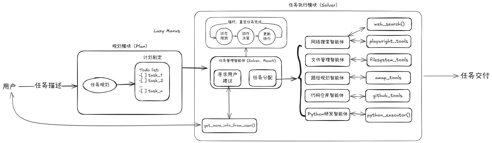

# Lazy Manus

An opensource Manus-like agent using lazyllm(https://github.com/LazyAGI/LazyLLM)

## Current Func

1. Plan and give Todo list for input task.
2. So many tools supported(Bocha AI search, browser use, coding, file system management, Amap func...)
3. MCP server supported.

## Plan-and-Solve Structure

## Quick Start

1. set deepseek api key "export LAZYLLM_DEEPSEEK_API_KEY=xxx"
2. set Bocha AI search api key in .env
3. Depends on your system(Linux/Windows), set specific command in ./mcp_config_list.json for every mcp server.
4. set api keys for github and amap mcp servers in mcp_config_list.json
5. start playwright mcp server in terminal and set url for remote_playwright mcp server in mcp_config_list.json.(e.x. For Windows: lazyllm deploy mcp_server --sse-port 11287 cmd -- /c npx @playwright/mcp@latest)
6. run python -m run_manus.py

### MCP Server List

1. filesystem: https://github.com/modelcontextprotocol/servers/tree/main/src/filesystem
2. github: https://github.com/modelcontextprotocol/servers/tree/main/src/github
3. playwright: https://github.com/microsoft/playwright-mcp
4. amap https://mcp.so/zh/server/amap-maps/amap

## Attention!!!

Friendly reminder: Running the application may consumes a significant amount of token quota, take care :)

## TODO List

1. Replay mode
